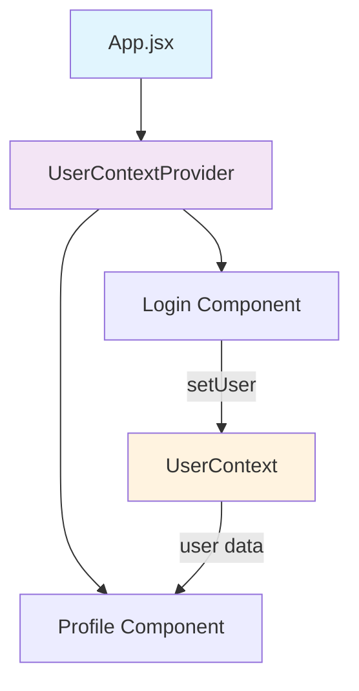

# 🚀 React Context API Demo

> A practical implementation of React Context API for state management - Learn how to share data across components without prop drilling!

[](https://react.dev/)
[](https://vitejs.dev/)
[](LICENSE)

## 📖 Table of Contents

- [Overview](#-overview)
- [What is Context API?](#-what-is-context-api)
- [Project Structure](#-project-structure)
- [How It Works](#-how-it-works)
- [Getting Started](#-getting-started)
- [Code Walkthrough](#-code-walkthrough)
- [Key Concepts](#-key-concepts)
- [Best Practices](#-best-practices)
- [Common Pitfalls](#-common-pitfalls)

## 🎯 Overview

This project demonstrates the **React Context API** through a simple authentication system. It shows how to:

- ✅ Share state across multiple components
- ✅ Avoid prop drilling
- ✅ Create a centralized state management solution
- ✅ Implement conditional rendering based on context state

## 🧠 What is Context API?

The Context API is React's built-in solution for sharing data between components without passing props down manually at every level. It's perfect for:

- **Global State**: User authentication, theme preferences, language settings
- **Avoiding Prop Drilling**: No need to pass props through intermediate components
- **Component Communication**: Share data between distant components in the tree

### Before Context API (Prop Drilling) 😫

```
App → Login → InputComponent → Button
 |      |          |           |
 |      |          |           └─ needs user data
 |      |          └─ passes props down
 |      └─ passes props down
 └─ has user data
```

### With Context API 😊

```
App (Provider)
├── Login (Consumer)
└── Profile (Consumer)
     └─ Both can access user data directly!
```

## 📁 Project Structure

```
src/
├── 📄 App.jsx                 # Main app component
├── 🎨 App.css                 # Styles
├── 📁 components/
│   ├── 🔐 Login.jsx           # Login form component
│   └── 👤 Profile.jsx         # User profile component
├── 📁 context/
│   ├── 🏗️ UserContext.js      # Context creation
│   └── 🔄 UserContextProvider.jsx # Context provider
└── 📄 main.jsx                # App entry point
```

## 🔄 How It Works



1. **Context Creation**: `UserContext.js` creates the context
2. **Provider Setup**: `UserContextProvider.jsx` manages state and provides it
3. **Consumer Usage**: Components use `useContext()` to access/modify state
4. **State Flow**: Login sets user → Profile displays user

## 🚀 Getting Started

### Prerequisites

- Node.js (v18 or higher)
- npm or yarn

### Installation

1. **Clone the repository**

   ```bash
   git clone https://github.com/anjali-ojha17/Context-API.git
   cd context-api-demo
   ```

2. **Install dependencies**

   ```bash
   npm install
   ```

3. **Start the development server**

   ```bash
   npm run dev
   ```

4. **Open your browser**
   ```
   http://localhost:5173
   ```

## 🔍 Code Walkthrough

### 1. Creating the Context (`UserContext.js`)

```javascript
import React from "react";

const UserContext = React.createContext();
export default UserContext;
```

> 💡 **This creates an empty context that components can subscribe to**

### 2. Context Provider (`UserContextProvider.jsx`)

```javascript
import React, { useState } from "react";
import UserContext from "./userContext";

const UserContextProvider = ({ children }) => {
  const [user, setUser] = useState(null);

  return (
    <UserContext.Provider value={{ user, setUser }}>
      {children}
    </UserContext.Provider>
  );
};
```

> 💡 **This component wraps other components and provides shared state**

### 3. Consuming Context (`Login.jsx`)

```javascript
import { useContext } from "react";
import UserContext from "../context/userContext";

const Login = () => {
  const { setUser } = useContext(UserContext);

  const handleSubmit = (e) => {
    e.preventDefault();
    setUser({ username, password });
  };
  // ... rest of component
};
```

> 💡 **useContext hook gives access to context value**

### 4. Reading Context (`Profile.jsx`)

```javascript
const Profile = () => {
  const { user } = useContext(UserContext);

  if (!user) return <div>Please Login</div>;
  return <div>Welcome {user.username}</div>;
};
```

> 💡 **Component automatically re-renders when context changes**

## 🎓 Key Concepts

### Context Provider

- **Purpose**: Supplies data to its children
- **Props**: `value` - the data to share
- **Children**: All nested components can access the context

### useContext Hook

- **Purpose**: Subscribes component to context changes
- **Returns**: Current context value
- **Automatic**: Re-renders component when context updates

### Context Value

- **State**: Current data (`user`)
- **Setters**: Functions to update data (`setUser`)
- **Objects**: Can contain multiple values and functions

## ✅ Best Practices

### 📌 DO's

- ✅ Use Context for truly global state
- ✅ Keep context values stable when possible
- ✅ Split large contexts into smaller ones
- ✅ Use TypeScript for better type safety
- ✅ Memoize context values if they're expensive

### ❌ DON'Ts

- ❌ Don't use Context for every state
- ❌ Don't create new objects in render on every render
- ❌ Don't forget to wrap components with Provider
- ❌ Don't overuse Context (local state is often better)

## ⚠️ Common Pitfalls

### 1. **Object Recreation**

```javascript
// ❌ Bad - Creates new object every render
<UserContext.Provider value={{ user, setUser }}>

// ✅ Good - Memoize the value
const value = useMemo(() => ({ user, setUser }), [user]);
<UserContext.Provider value={value}>
```

### 2. **Missing Provider**

```javascript
// ❌ This will cause an error
const { user } = useContext(UserContext); // No provider above!

// ✅ Make sure component is wrapped
<UserContextProvider>
  <ComponentThatUsesContext />
</UserContextProvider>;
```

### 3. **Context Hell**

```javascript
// ❌ Too many nested providers
<UserProvider>
  <ThemeProvider>
    <LanguageProvider>
      <NotificationProvider>
        <App />
      </NotificationProvider>
    </LanguageProvider>
  </ThemeProvider>
</UserProvider>

// ✅ Combine or use a state management library for complex apps
```

## 🎮 Try It Out!

1. **Run the app**: `npm run dev`
2. **Enter credentials**: Type any username/password
3. **Click Login**: Watch the Profile component update automatically
4. **No prop drilling**: Notice how data flows directly to Profile

## 🔗 Learn More

- [React Context API Docs](https://react.dev/reference/react/createContext)
- [useContext Hook](https://react.dev/reference/react/useContext)
- [React State Management](https://react.dev/learn/managing-state)

## 📝 License

This project is open source and available under the [MIT License](LICENSE).

---

⭐ **Star this repo if you found it helpful!** ⭐

Made with ❤️ for learning React Context API
